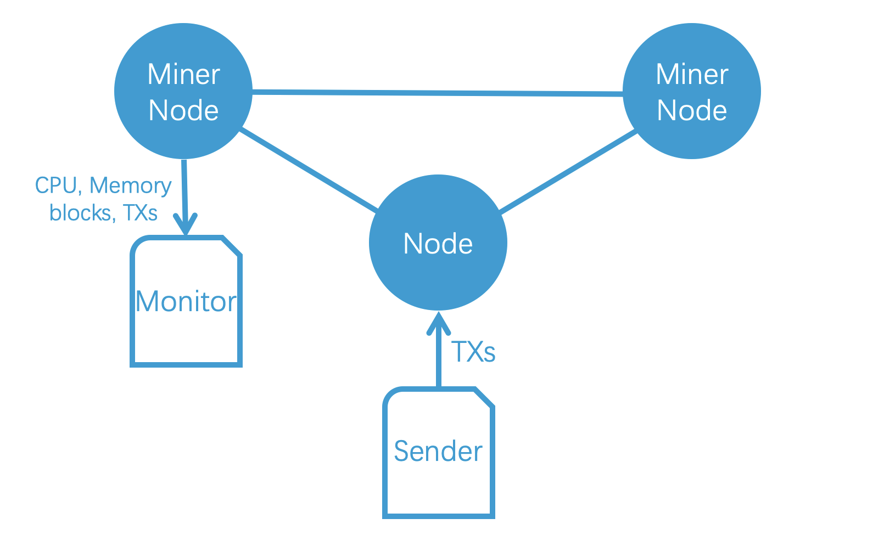
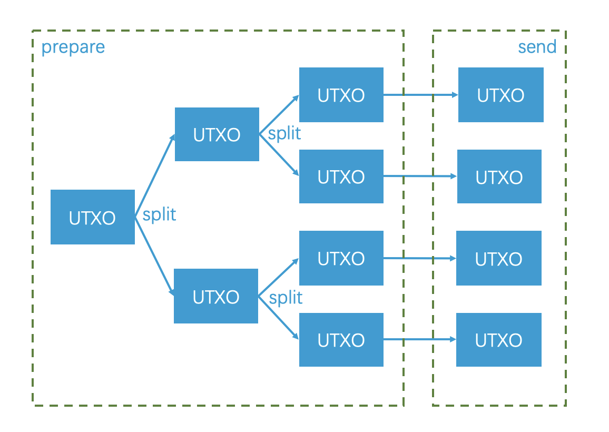
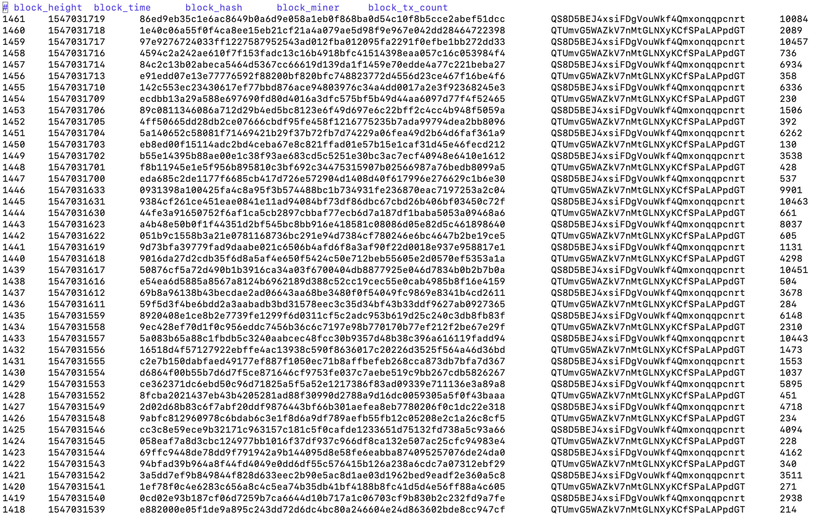
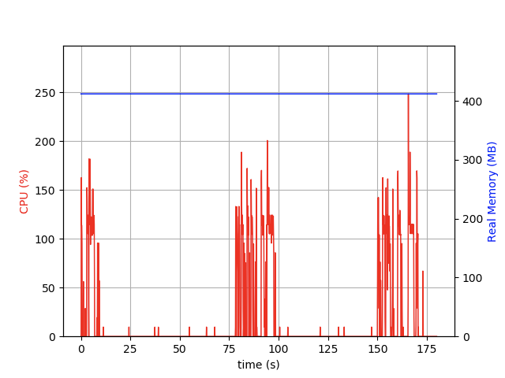
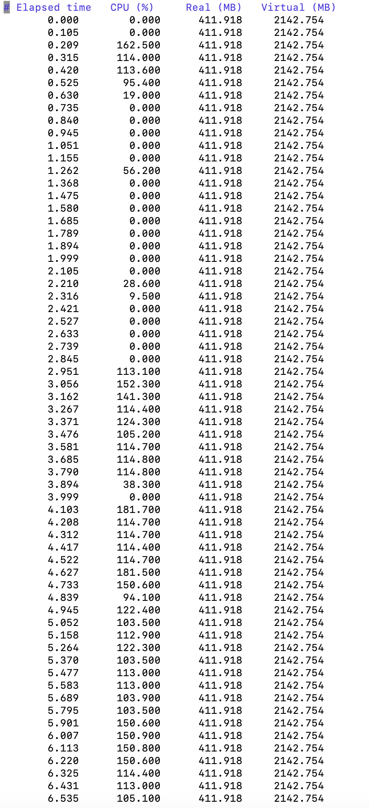

# Unita Benchmark

## Abstract
Recently we did some benchmark testing on Unita. It illustrates that Unita can handle more than 10,000 TPS. This paper shares the method, process, and results on how we achieved this throughput level.

## Introduction

Unita is an enterprise-level blockchain system. It aims to realize high TPS (Transactions Per Second) and low confirmation time of the blockchain, to make DApps (Decentralized Applications) applicable to more business scenarios. Meanwhile, we intend to minimize storage and network consumption, so as to reduce operating costs. It’s developed on the basis of Qtum which is compatible with the Bitcoin UTXO data structure and Ethereum Solidity smart contracts.

The consensus of Unita is PoA (Proof of Authority) & [SCAR](https://doc.unita.network/en/SCAR-Consensus/) which is widely used in consortium blockchains. In PoA, only a number of miners are authorized to mine new blocks in a round-robin manner. These miners are also called “supernodes” since they often demand large disks and high-speed network connections to ensure unparalleled blockchain performance.

In Unita, we introduce the SCAR (Scalable Consensus Algorithm) to reduce the demand for storage and network resources. Its basic idea is to slow down block generating when the transaction volume of the blockchain network is low. Now our first version of SCAR adopts the following strategy. The system stops generating new blocks when there is no pending transaction in the mempool. It can be upgraded later without any fork since in PoA it only needs those miners to upgrade their nodes.

## Preparation

### Server

We choose an Amazon EC2 virtual server to do the benchmark. The specifications are:
- 8 Core VCPU
- 16GB ram
- 30GB ssd /dev/nvme1n1 (170.55 MB/sec)
- 200gb NVME SSD /dev/nvme0n1 (434.44 MB/sec)

We also checked its CPU information in the command line:
```
$ uname -a
Linux ip-172-31-15-163 4.15.0-1021-aws #21-Ubuntu SMP Tue Aug 28 10:23:07 UTC 2018 x86_64 x86_64 x86_64 GNU/Linux
$ cat /etc/issue
Ubuntu 18.04.1 LTS \n \l
$ cat /proc/cpuinfo | grep cores | uniq
cpu cores	: 4
$ cat /proc/cpuinfo | grep processor | wc -l
8
$ cat /proc/cpuinfo | grep "model name" | uniq
model name	: Intel(R) Xeon(R) Platinum 8124M CPU @ 3.00GHz
$ cat /proc/cpuinfo | grep MHz
cpu MHz		: 3400.903
cpu MHz		: 3415.303
cpu MHz		: 3403.405
cpu MHz		: 3400.123
cpu MHz		: 3412.838
cpu MHz		: 3403.137
cpu MHz		: 3411.813
cpu MHz		: 3422.359
```

---

## Node
Three nodes are launched to form a blockchain network. Two of them are miners for generating new blocks. The other is to accept transactions from RPC and relay them to miners.



Unita uses a webapp to generate configurations for a new blockchain. We create a new blockchain named benchmarktest for the benchmark and its configurations are detailed in this page. Note that the block interval is set to 1 second which means every transaction can be confirmed within 1 second.

To make the 3rd node able to accept a large number of transactions from RPC, it needs to be started with the arguments of “-rpcthreads=100 -rpcworkqueue=100”, which enable the RPC to handle 100 requests in parallel.

### Sender

The role of the sender is to push a large number of transactions into the node. 

So it needs to:
- Prepare many signed UTXOs;
- Send them to the node in parallel.

For more details, please refer to its source code, bench.js, in [unita-benchmark-script](https://github.com/UnitaNetwork/unita-benchmark-script).



### Monitor

The monitor is used to obtain various information about the miner node, like the CPU and memory usage, the blocks and transactions generated.

For CPU and memory, we had to research suitable tools and finally choose [psrecord](https://github.com/astrofrog/psrecord), since it can draw a graph to show how CPU and memory changes. For blocks and transactions, we developed a script ourselves, which is list.js in [unita-benchmark-script](https://github.com/UnitaNetwork/unita-benchmark-script).

## Result

### Parameter

The benchmark lasted for 180 seconds and the sender was executed 3 times. Each time 50,000 UTXOs were prepared and then sent to the blockchain network.

### TPS

Generated blocks and transactions are shown as follows. You can see that there are 5 blocks containing more than 10,000 transactions: height 1461, 1459, 1445, 1439, and 1433. This proves Unita is able to handle more than 10,000 TPS. When there is no transaction, Unita stops producing new blocks which saves storage and network resources.

We also found that transactions are not relayed at a constant speed. When we push a really large amount of transactions to a node through RPC, these transactions cannot be relayed immediately (although INVENTORY_BROADCAST_INTERVAL has been already set to 1s in Unita). This is caused by some mutex locks in the code and will not happen in real situations where transactions are not created by a single node.



### CPU

The graph and part of the log generated by psrecord are shown as follows. The memory stays constant. The CPU rise up to a maximum of 250% at the 3rd time and kept in approximate 120% on average.





## Future

The benchmark demonstrates that Unita has a high performance with more than 10,000 TPS, transactions can be confirmed immediately after they are sent to the network with low storage and network consumption. Unita is suitable for DApps, especially in business scenarios, where it will have great advantages.


