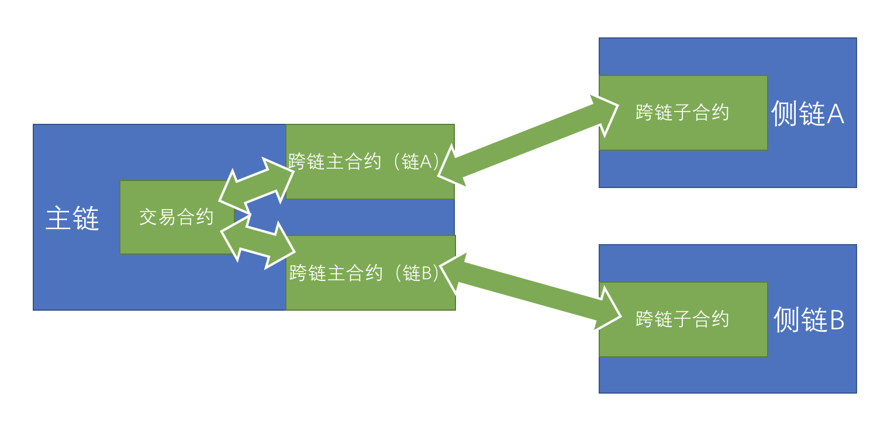

# Canal: 一种跨链交易解决方案

# 背景介绍
随着区块链技术的发展，基于区块链的数字货币也大量涌现。这些数字货币分布在不同的区块链网络中，无法直接进行数据互通，因此主要借助于数字货币交易所进行交易。传统的数字货币交易所多为中心化的服务，在安全性、隐私性等方面都受到挑战。而运行在链上的去中心化交易所，因为其数据透明、隐私保障、实时结算等优点，越来越受到广泛的关注。

当前提出的去中心化交易所大都只实现了同一条链上的代币交易，并不能实现跨链的数字货币交易，限制了去中心化交易所的应用场景。本文提出了一种去中心化的数字货币交易所的解决方案，使用该解决方案可以实现跨链的数字货币交易。这里我们仅阐述基本的想法，具体的设计和开发仍在进行中。

我们将这个解决方案称为运河（Canal），因为运河实现的是多个城市之间的货物运输和交易。该方案设计的初衷是，当用户使用[一键发链](https://chain.unita.network)服务发布了自己的区块链后，可以借助该解决方案实现与其他链上数字货币的兑换，从而方便数字货币的流通。

# 相关技术
## 去中心化交易所
目前提出的去中心化交易所可分为以下两类。

### 挂单撮合
包括0x[1]、Kyber Network[2]在内的去中心化交易所系统都属于挂单撮合交易的类型。用户通过智能合约发布自己的买单或者卖单，然后系统帮助寻找最合适的买卖单组合进行交易。这种去中心化的交易所可以看做是把原本中心化交易所的交易流程移植到了链上，交易的流程机制并未发生变化。

这种交易方式的优点如下：
1. 交易透明：挂单数据完全公开；
2. 资金安全：数字货币通过智能合约管理，交易完成后及时转至用户账户；
3. 交易成本低：除了区块链gas，没有第三方费用。

缺点如下：
1. 交易在区块链上完成，交易速度慢；
2. 市场不活跃时，买卖双方难以达成一致，流动性变弱。

### 自动定价
Bancor Network[3]通过智能合约，实现了用户和数字货币资金池之间的自动定价交易。交易流程如下：
1. 搭建交易合约，并往合约里存入一定数量的数字货币A和B作为初始时刻的资金池；
2. 当用户需要使用A币换取B币的时候，先把A币存入合约的资金池中；然后系统会根据当前合约中的A、B币的存量计算出A至B的转换率，并把资金池中对应数量的B币转至用户账户。
3. 如果用户不断地使用A币换取B币，则资金池中的A币增加，B币减少，从而转换率降低，即A币能换取到的B币减少。

自动定价交易的优点如下：
1. 无需支付巨额上币费用。
2. 用户买卖不需要挂单，可随时交易。
3. 保证流动性，用户无需担心交易深度。

缺点如下：
1. 需要项目方提前质押一部分币到系统中
2. 当前只支持同一条链上的数字货币转换

## 跨链技术
区块链网络之间数据无法互通，极大程度的限制了区块链的应用空间。跨链技术旨在解决这一问题，实现区块链之间的数据传输。目前市场上的跨链解决方案，仅仅实现了不同区块链上价值的交换，而并未实现交易功能；即数字货币仅能按照预先约定的转换率进行转换，而不能随着市场动态变化价格。这点一定程度上阻碍了数字货币价值的自由流动，也限制了跨链技术的应用空间。

跨链的解决方案可以分为两类。

### 中继
一类是使用一条主链连接各个侧链，实现侧链之间的数据互通，这条主链通常称为Hub或Relay。比如Cosmos[4]、Polkadot[5]等，其基本思想大体一致：
1. 主链采用dPoS（Delegated Proof of Stake）、PoA（Proof of Authority）等弱中心化的共识算法，即区块的产出是由少数超级节点完成的，或者可以称之为联盟链。
2. 主链的超级节点监控侧链的数据变化，然后在主链产生相应的数据；或是监控主链数据的变化，在侧链产生相应的数据。从而实现主链和侧链数据的互通。

这种跨链模式的优点是数据传输快速高效，且可以传输链上任何形式的数据；缺点是带来了中心化，即跨链数据的准确性和完整性依赖了联盟链的超级节点。

### 原子交换
原子跨链交换[6]是使用区块链的脚本，实现两个区块链网络中的数字货币进行原子交换。这里原子的意思是指，交换双方在两个区块链系统上发布的两笔交易必须同时完成或同时失败。其具体步骤如下：

1. Alice用自己的A币交换Bob拥有的B币。
2. Alice创建交易，将A币支付给一个输出脚本，这个脚本需要用一个Alice自己知道的key和Bob的签名才能解开。
3. Bob看到这笔交易后，也创建交易，将B币支付给一个输出脚本，这个脚本需要同样的key和Alice的签名才能解开。
4. Alice用key和签名解开Bob创建的交易，将B币转移至自己的账户地址，key会随着转移操作而上链。
5. Bob看到链上的key之后，使用key和自己的签名解开Alice创建的交易，并将A币转移至自己的账户地址，交换完成。
6. 如果Alice和Bob在过程中终止操作，则两笔交易在一定时间后，会分别退还给Alice和Bob，交换失败。

这种跨链模式的优点是完全的去中心化，交换不依赖任何第三方；缺点是一次交换过程必须依赖4次交易才能完成，速度慢效率低。

# 算法介绍
本文提出了一种去中心化的跨链数字货币交易所解决方案。其交易流程由一个联盟链网络和多个智能合约完成。以这样一个场景为例进行说明：侧链A上的数字货币需要换成侧链B上的数字货币，我们通过主链作为中继完成这笔交易。

## 主链
主链采用联盟链。联盟链的超级节点通过交易所的所有用户投票得到，或其他任意方式。超级节点负责验证区块链上的所有交易，并产生新的区块。主链连接了所有需要进行交易的侧链，从而保证了数据可以进行跨链传输。同时，主链负责运行数字货币交易所需的智能合约。方案的细节将在下文中描述。

## 跨链
跨链部分采用中继的模式，由两个合约组成，一个部署在主链上，称之为主合约，另一个部署在侧链上，称之为子合约。子合约是用于用户在侧链上进行充币和提币的，和中心化交易所中的充提币概念一致。主合约是用来同步用户的充提币和交易记录，并且存储用户余额的。

跨链步骤如下：
1. 充币
  1. 用户向侧链A上的子合约中存入需要兑换的数字货币A。
  2. 超级节点监听到子合约地址下的数字货币A数量变化，然后在主合约中往用户的地址下增加相应数量的代币。
2. 交易
  3. 用户操作用主合约中自己地址下的代币调用交易接口。
  4. 接口将转换后的数字货币B转移至主合约B的用户地址下。
3. 提币
  5. 用户向侧链B的子合约发起提币请求。
  6. 超级节点监听到侧链B上的提币请求，然后销毁主合约中用户的代币，并在侧链B上将对应数量的数字货币B转移至用户地址下。

## 交易
交易采用自动定价的模式，由一个智能合约组成。合约在初始化的时候，需要充入一定数量的数字货币A、B，作为资金池，从而实现A与B之间的交易。

交易的流程如下：
1. 用户想将一定数量的数字货币A转换为数字货币B。
2. 用户将需要转换数字货币A存入合约地址下，进入资金池。
3. 系统根据需要转换的A的数量和当前资金池中A、B的存量，计算出能转换到的B的数量。
4. 系统将转换到的B从系统的资金池转出到用户的地址。

步骤3中的转换计算需要遵循以下原则：
1. 资金池内的A越少，则A到B的转换率越高。B也亦然。
2. 不能将资金池中的任何一种数字货币用尽，否则则无法继续转换。

基于以上原则，转换的逻辑可以有多种设计。例如：
1. 假设资金池中的数字货币A、B的存量分别为a0、b0（a0 > 0，b0 > 0），用户想要将△a（△a > 0）的数字货币A转换，得到△b（△b > 0）的数字货币B。
2. 则能转换到的B的数量为：△b =( b0 *△a ) / (a0 + △a)。
3. 可以看到，△b是b0的增函数，是a0的减函数，符合上文中的原则1。
4. 可以看到，△b < b0，则资金池中的B不会用尽，符合上文中的原则2。

# 总结
在设计的过程中，我们有两点思考。第一，我们觉得不应过分强调去中心化，而牺牲交易的效率；因为如果交易的速度太慢，则会影响用户的体验；而去中心化的需求在一个联盟链的系统中，通过投票给可信的超级节点，也是一定程度上可以满足的。第二，自动定价交易的模式在实际的使用中应该是明显优于挂单交易的，因为很多新发的数字货币交易量小流动性无法保证，而自动定价交易的模式很好地解决了流动性的问题。

# 参考文献
[1] 0x protocol. https://www.0xproject.com/

[2] Kyber network. https://kyber.network/

[3] Bancor. https://www.bancor.network/

[4] Cosmos. https://cosmos.network/

[5] Polkadot. https://polkadot.network/

[6] Atomic Cross-Chain Swaps. https://arxiv.org/abs/1801.09515

